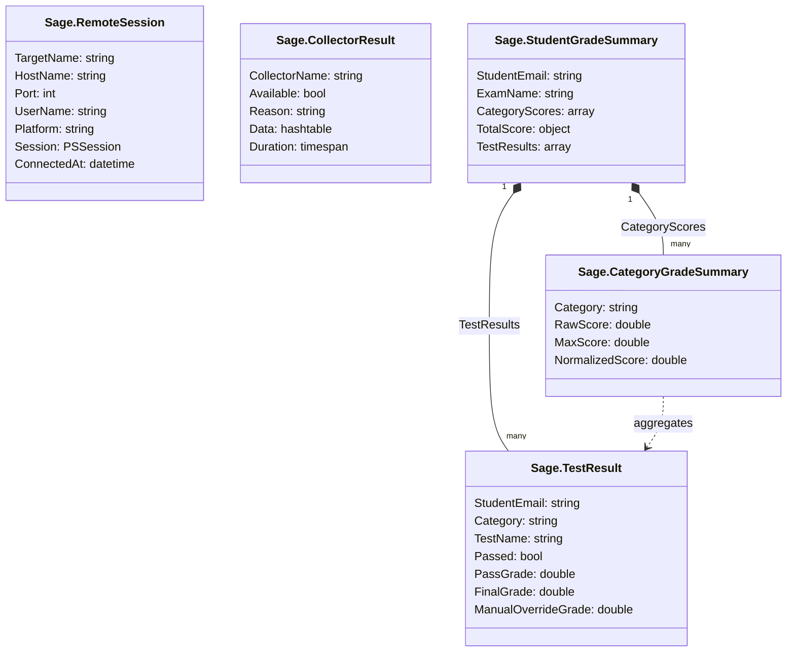
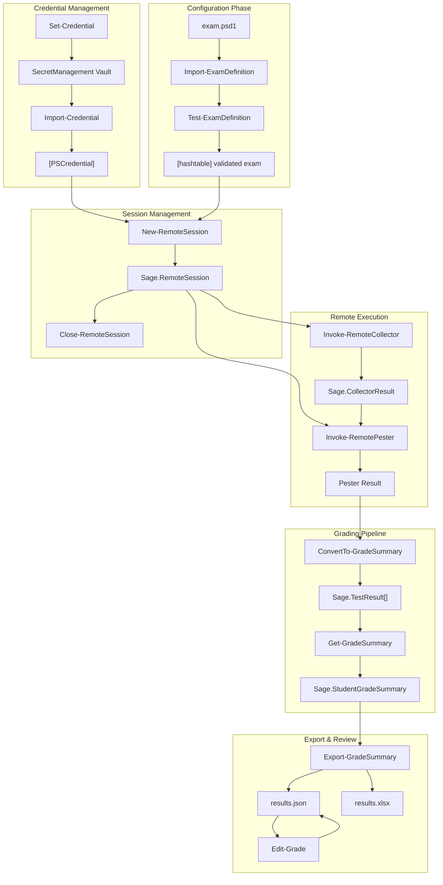
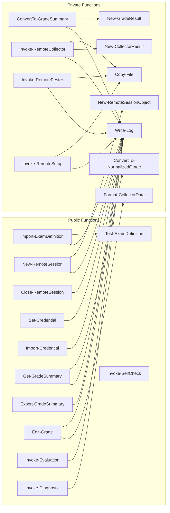
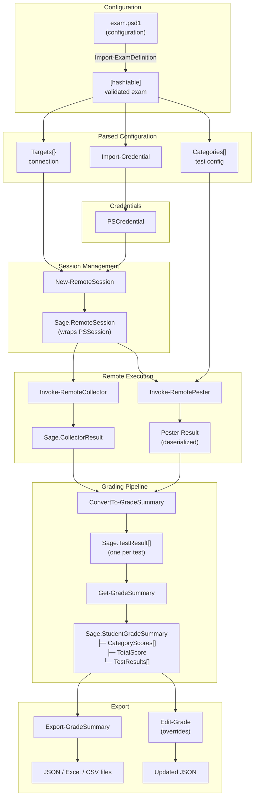
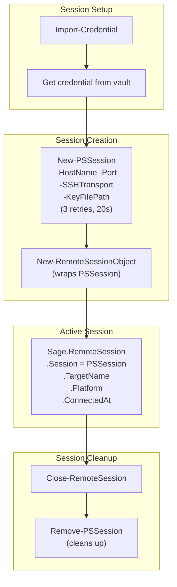
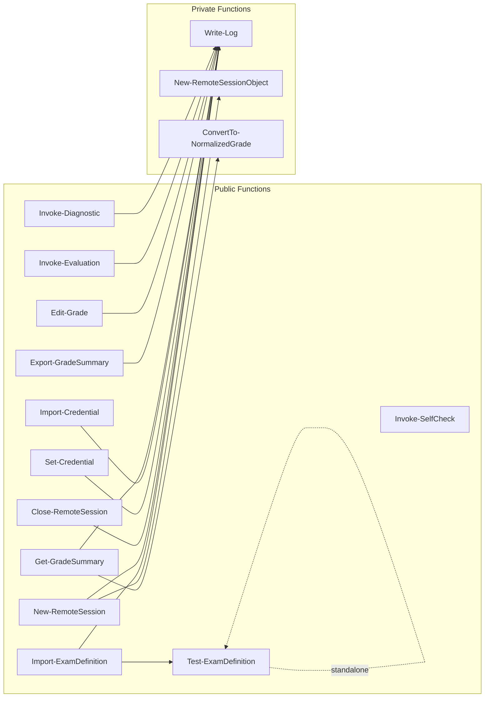
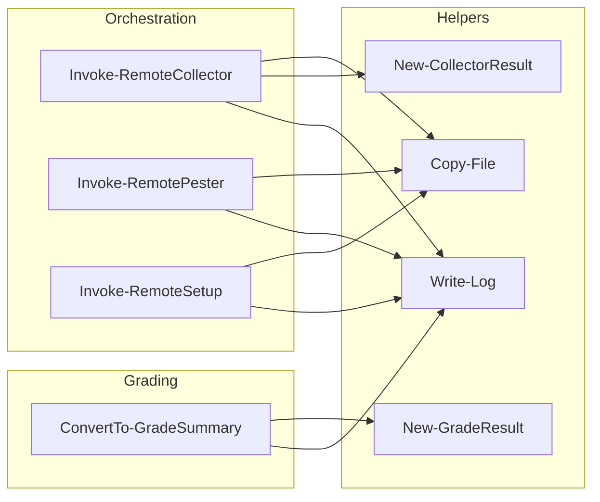
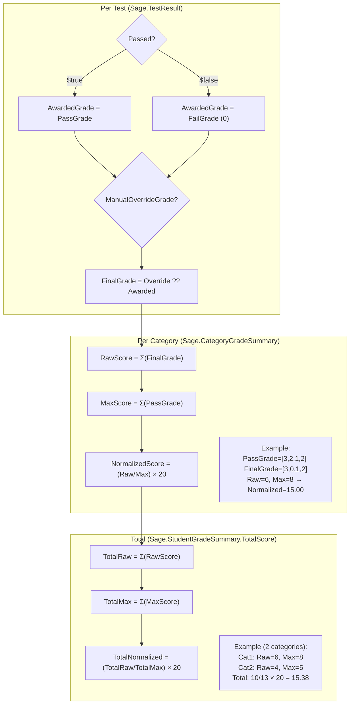

# SAGE Module Architecture Overview

> **Purpose:** Manual code review reference for AI-generated code
> **Created:** 2026-03-21

## Table of Contents

1. [Module Structure](#1-module-structure)
2. [Data Types (PSCustomObjects)](#2-data-types-pscustomobjects)
3. [Public Functions](#3-public-functions)
4. [Private Functions](#4-private-functions)
5. [Data Flow Diagrams](#5-data-flow-diagrams)
6. [Function Call Graph](#6-function-call-graph)
7. [Complete Evaluation Pipeline](#7-complete-evaluation-pipeline)

---

## 1. Module Structure

```text
sage/
├── sage.psd1          # Module manifest (exports, version, dependencies)
├── sage.psm1          # Loader: dot-sources Private/ then Public/, exports Public
│
├── Public/            # Exported to users (15 functions)
│   ├── Test-ExamDefinition.ps1
│   ├── Import-ExamDefinition.ps1
│   ├── New-RemoteSession.ps1
│   ├── Close-RemoteSession.ps1
│   ├── Get-GradeSummary.ps1
│   ├── Export-GradeSummary.ps1
│   ├── Edit-Grade.ps1
│   ├── Set-Credential.ps1
│   ├── Import-Credential.ps1
│   ├── Invoke-Evaluation.ps1
│   ├── Invoke-Diagnostic.ps1
│   ├── Invoke-SelfCheck.ps1            # Student self-evaluation TUI entry point
│   ├── Set-SageLogPath.ps1           # Parallel scope bridge — see §3.6
│   └── Invoke-StudentEvaluation.ps1  # Per-student wrapper — see §3.6
│
├── Private/           # Internal helpers (11 functions)
│   ├── Write-Log.ps1
│   ├── New-RemoteSessionObject.ps1
│   ├── New-GradeResult.ps1
│   ├── New-CollectorResult.ps1
│   ├── ConvertTo-GradeSummary.ps1
│   ├── ConvertTo-NormalizedGrade.ps1
│   ├── Copy-File.ps1
│   ├── Format-CollectorData.ps1
│   ├── Invoke-RemoteCollector.ps1
│   ├── Invoke-RemotePester.ps1
│   └── Invoke-RemoteSetup.ps1
│
├── data/exams/ # Exam definitions (exam.psd1 files)
├── Collectors/        # Scripts that run ON remote VMs (11 collector scripts)
├── Evaluations/       # Pester test files for grading (11 evaluation files)
└── Tests/             # Unit tests for the module itself
```

---

## 2. Data Types (PSCustomObjects)

All custom objects use `PSTypeName = 'Sage.<Purpose>'` for type identification.

### 2.1 Sage.RemoteSession

**Created by:** `New-RemoteSessionObject` (Private)  
**Consumed by:** `Close-RemoteSession`, `Invoke-RemoteCollector`, `Invoke-RemotePester`, `Invoke-RemoteSetup`

```powershell
[PSCustomObject]@{
    PSTypeName       = 'Sage.RemoteSession'
    TargetName       = [string]   # Logical name from exam.psd1 (e.g., 'LinuxVM')
    HostName         = [string]   # DNS/IP of remote host
    Port             = [int]      # SSH port (1-65535)
    UserName         = [string]   # SSH username
    Platform         = [string]   # 'Windows' or 'Linux'
    Session          = [PSSession] # Active PowerShell session
    CredentialSecret = [string]   # Vault entry name (audit trail)
    ConnectedAt      = [datetime] # Connection timestamp
    SessionId        = [int]      # PSSession ID
}
```

### 2.2 Sage.CollectorResult

**Created by:** `New-CollectorResult` (Private)  
**Consumed by:** `ConvertTo-GradeSummary`, `Invoke-RemotePester`

```powershell
[PSCustomObject]@{
    PSTypeName    = 'Sage.CollectorResult'
    CollectorName = [string]   # Short name (e.g., 'Dns', 'Docker')
    Available     = [bool]     # Was the service/role reachable?
    Reason        = [string]   # Human-readable reason if Available = $false
    Data          = [hashtable] # Structured data from collector
    Errors        = [string[]] # Non-fatal errors during collection
    Duration      = [timespan] # Elapsed time
}
```

### 2.3 Sage.TestResult

**Created by:** `New-GradeResult` (Private)  
**Consumed by:** `Get-GradeSummary`, `Export-GradeSummary`, `Edit-Grade`

```powershell
[PSCustomObject]@{
    PSTypeName           = 'Sage.TestResult'
    StudentEmail         = [string]   # For traceability
    StudentName          = [string]   # Display name
    StudentData          = [hashtable] # Full CSV row (all roster fields)
    TargetName           = [string]   # Logical target name
    Category             = [string]   # Category from exam.psd1
    TestName             = [string]   # Pester test description
    Context              = [string]   # Pester Context block name
    Passed               = [bool]     # Did the test pass?
    PassGrade            = [double]   # Points if passed (0-100)
    FailGrade            = [double]   # Points if failed (usually 0)
    AwardedGrade         = [double]   # Automatic grade (PassGrade or FailGrade)
    ActualValue          = [string]   # What was found (from error message)
    ExpectedValue        = [string]   # What was expected (from error message)
    ManualOverrideGrade  = [double]   # Teacher override (null = no override)
    ManualOverrideReason = [string]   # Reason for override
    FinalGrade           = [double]   # AwardedGrade OR ManualOverrideGrade
    ErrorMessage         = [string]   # Full Pester error message
    ReviewData           = [object]   # Structured data for manual review
    ReviewContextName    = [string]   # Context name for ReviewContextMap lookup
    Timestamp            = [datetime]
}
```

### 2.4 Sage.CategoryGradeSummary

**Created by:** `Get-GradeSummary` (Public)  
**Consumed by:** `Export-GradeSummary`, as part of `StudentGradeSummary`

```powershell
[PSCustomObject]@{
    PSTypeName      = 'Sage.CategoryGradeSummary'
    Category        = [string] # Category name (e.g., 'DNS', 'Docker')
    TargetName      = [string] # Target VM name
    RawScore        = [double] # Sum of FinalGrade
    MaxScore        = [double] # Sum of PassGrade (maximum possible)
    NormalizedScore = [double] # (RawScore/MaxScore) × 20
    TestCount       = [int]    # Total tests in category
    PassedCount     = [int]    # Tests that passed
    FailedCount     = [int]    # Tests that failed
}
```

### 2.5 Sage.StudentGradeSummary

**Created by:** `Get-GradeSummary` (Public)  
**Consumed by:** `Export-GradeSummary`, `Edit-Grade`

```powershell
[PSCustomObject]@{
    PSTypeName     = 'Sage.StudentGradeSummary'
    StudentEmail   = [string]      # Student identifier
    StudentName    = [string]      # Display name
    StudentData    = [hashtable]   # Full CSV row
    ExamName       = [string]      # From exam.psd1
    GradedAt       = [datetime]    # Timestamp
    CategoryScores = [array]       # Array of Sage.CategoryGradeSummary
    TotalScore     = [PSCustomObject] # { Raw, Max, Normalized }
    OverrideCount  = [int]         # Number of manual overrides
    TestResults    = [array]       # Array of Sage.TestResult (full details)
}
```

---

## 3. Public Functions

### 3.1 Configuration & Validation

- **`Test-ExamDefinition`**: Validates exam.psd1 schema
  - Input: `-Path` or `-ExamDefinition` hashtable
  - Output: `[bool]` (throws on error unless `-PassThru`)

- **`Import-ExamDefinition`**: Loads and validates exam.psd1
  - Input: `-Path` to exam.psd1
  - Output: `[hashtable]` with `_ExamPath`, `_ExamDir` injected

### 3.2 Session Management

- **`New-RemoteSession`**: Creates SSH PSSession to VM
  - Input: `-HostName`, `-Port`, `-UserName`, `-KeyFilePath`, `-TargetName`, `-Platform`
  - Output: `Sage.RemoteSession`

- **`Close-RemoteSession`**: Closes PSSession(s)
  - Input: `-Session` (one or more `Sage.RemoteSession`)
  - Output: None

### 3.3 Credential Management

- **`Set-Credential`**: Stores PSCredential in vault
  - Input: `-Name`, `-Credential`
  - Output: None

- **`Import-Credential`**: Retrieves PSCredential from vault
  - Input: `-Name`, `-AllowPrompt`
  - Output: `[PSCredential]`

### 3.4 Grading & Export

- **`Get-GradeSummary`**: Aggregates TestResults into summary
  - Input: `-TestResult[]`, student info, `-ExamName`
  - Output: `Sage.StudentGradeSummary`

- **`Export-GradeSummary`**: Writes results to files
  - Input: `-GradeSummary`, `-OutputPath`, `-Format`
  - Output: `[string[]]` (file paths)

- **`Edit-Grade`**: Manual grade overrides
  - Input: `-ResultsPath`, `-Overrides`
  - Output: Updated `StudentGradeSummary`

### 3.5 Orchestration

- **`Invoke-Evaluation`**: Full pipeline runner
  - Input: `-ExamPath`, `-RosterPath`, `-OutputDir`, `-ThrottleLimit`, `-KeyFilePath`, `-SaveCollectorData`
  - Output: `Sage.StudentGradeSummary[]`

- **`Invoke-Diagnostic`**: Connectivity and health checks
- **`Invoke-SelfCheck`**: Validates module dependencies

### 3.6 Parallel Infrastructure (Public by necessity, not by design intent)

These two functions exist purely to solve PowerShell runspace scoping constraints
in `ForEach-Object -Parallel`.  They are not part of the everyday grading
workflow — use `Invoke-Evaluation` for that.

#### Set-SageLogPath — Log-path scope bridge

See existing §3.6 section below for the full scope diagram.

#### Invoke-StudentEvaluation — Per-student pipeline wrapper

`Invoke-StudentEvaluation` contains all the per-student work originally inlined
in the parallel scriptblock of `Invoke-Evaluation`.  It is Public because:

- A `ForEach-Object -Parallel` scriptblock runs in user-space inside a new
  runspace.
- After `Import-Module`, only **public** functions are callable from the
  scriptblock — private helpers (`Write-Log`, `Invoke-RemoteSetup`,
  `Invoke-RemoteCollector`, `Invoke-RemotePester`, `ConvertTo-GradeSummary`,
  `New-GradeResult`) are not.
- Placing all that logic inside a public module function means the private
  helpers are called from within the module (where they are accessible).

The parallel scriptblock in `Invoke-Evaluation` reduces to three lines:

```powershell
Import-Module $ModulePath -Force           # fresh scope
Set-SageLogPath -Path $LogPath             # wire log file
Invoke-StudentEvaluation @StuParams        # all private calls happen inside
```

The sequential loop in `Invoke-Evaluation` also uses `Invoke-StudentEvaluation`,
eliminating code duplication.  Private functions are accessible there because
the sequential path runs inside `Invoke-Evaluation`, which is itself a module
function — and `Invoke-StudentEvaluation` is a module function too, so all
private helpers are reachable from both call sites.

**`Set-SageLogPath`** exists solely to solve a PowerShell runspace scoping
problem that arises during parallel student processing.

#### The problem

`Write-Log` writes structured JSONL entries to a file path stored in
`$script:LogPath` (module scope).  `Invoke-Evaluation` sets this variable
before processing begins.  When `ThrottleLimit > 1`, each student runs inside
an independent `ForEach-Object -Parallel` runspace.  Each runspace calls
`Import-Module`, which creates a **brand-new, isolated module scope** — the
`$script:LogPath` from the host process is invisible there, so `Write-Log`
silently skips all file output.

#### Why not `$global:`?

`$global:` variables are process-wide and cross all module boundaries.  They
pollute the caller's environment, break encapsulation, and are inherently
fragile in concurrent code (any runspace, or any imported module, can
collide on the same name).

#### The solution

`Set-SageLogPath` is a thin Public function that writes `$script:LogPath` in
the module scope where it is **called from**.  Invoking it inside a parallel
runspace, immediately after `Import-Module`, targets that runspace's freshly-
created module scope:

```powershell
# Inside ForEach-Object -Parallel:
Import-Module $ModulePath -Force   # creates fresh scope; $script:LogPath = $null
Set-SageLogPath -Path $LogPath     # fills $script:LogPath in THIS scope
# Write-Log now sees $script:LogPath and appends to the shared file ✓
```

The shared file is written safely via a named mutex (`Local\sage-Log`) that
`Write-Log` acquires for every append.

```text
Host process                         Parallel runspace (per student)
─────────────────────────────────    ────────────────────────────────
$script:LogPath = $TempLogPath       Import-Module $ModPath -Force
                                     Set-SageLogPath -Path $LogPath
ForEach-Object -Parallel {    ──►    $script:LogPath = $LogPath  ✓
    Write-Log ...             ◄──    Write-Log appends (mutex)
}
```

---

## 3.7 Student Self-Evaluation TUI

`Invoke-SelfCheck` is the entry point for the student-facing self-check.
Students run it against their own VMs without any instructor involvement,
using the same evaluation pipeline as the graded exams.

**Entry points:**

- `pwsh ./Start-SelfCheck.ps1` — root-level convenience launcher
- `pwsh ./Sage/tui/Start-SelfCheck.ps1` — TUI subdirectory launcher
- `Invoke-SelfCheck` — after `Import-Module ./Sage/Sage.psd1` (programmatic)

**Architecture:**

```text
Start-SelfCheck.ps1  (root or Sage/tui/)
        │
        ▼
Import-Module Sage.psd1 → Invoke-SelfCheck (Public)
        │  dot-sources Sage/tui/Private/*.ps1 at runtime
        │
        ├── Initialize-TuiUserConfig    (load/create tui-config-personal.psd1)
        ├── Show-MainMenu               (main loop)
        │       ├── Show-Settings       (domain, output dir, theme)
        │       ├── Show-TargetSelector (pick which VMs to check)
        │       ├── Show-CategorySelector (pick categories from exam)
        │       ├── Invoke-LocalEvaluation ◄── core evaluation
        │       │       │  calls Invoke-Evaluation (Public) with a single-student roster
        │       │       └── returns Sage.StudentGradeSummary[]
        │       ├── Show-ResultsSummary (category scores + pass/fail counts)
        │       ├── Show-TestDetail     (per-test actual vs expected)
        │       └── Show-PreviousRuns   (compare across runs)
        └── (Write results to Sage/data/output/  — gitignored)
```

**Why `tui/Private/` is separate from `Sage/Private/`:**

The ~25 TUI helper functions are UI-only (menus, prompts, color output, SSH key
wizard). They are NOT loaded when `Import-Module Sage.psd1` is called for
programmatic use (e.g., `Invoke-Evaluation`). `Invoke-SelfCheck` dot-sources
them on demand at runtime, keeping module import fast and the public API clean.

**Config files:**

| File | Purpose |
|------|---------|
| `Sage/tui/tui-config.psd1` | Shipped defaults — read-only, never modified |
| `Sage/data/config/tui-config-personal.psd1` | User overrides — auto-created on first setting change, gitignored |

See [docs/internal/TUI-PLAN.md](internal/TUI-PLAN.md) for complete feature list (internal/private repo only).

---

## 4. Private Functions

### 4.1 Factory Functions (Create PSCustomObjects)

- **`New-RemoteSessionObject`** → `Sage.RemoteSession`
  - Called by: `New-RemoteSession`

- **`New-CollectorResult`** → `Sage.CollectorResult`
  - Called by: `Invoke-RemoteCollector`

- **`New-GradeResult`** → `Sage.TestResult`
  - Called by: `ConvertTo-GradeSummary`

### 4.2 Remote Execution

- **`Copy-File`**: Copies file to remote VM via PSSession
  - Called by: `Invoke-RemoteCollector`, `Invoke-RemotePester`, `Invoke-RemoteSetup`

- **`Invoke-RemoteSetup`**: Installs modules, copies scripts to VM
  - Called by: (Future) `Invoke-Evaluation`

- **`Invoke-RemoteCollector`**: Runs collector script on remote VM
  - Called by: (Future) `Invoke-Evaluation`

- **`Invoke-RemotePester`**: Runs Pester tests on remote VM
  - Called by: (Future) `Invoke-Evaluation`

### 4.3 Grading Helpers

- **`ConvertTo-GradeSummary`**: Converts Pester results to TestResult[]
  - Called by: (Future) after `Invoke-RemotePester`

- **`ConvertTo-NormalizedGrade`**: Raw score → /20 scale
  - Called by: `Get-GradeSummary`

### 4.4 Logging

- **`Write-Log`**: Structured logging (console + JSONL)
  - Called by: All functions

---

## 5. Data Flow Diagrams

### 5.1 Mermaid: Type Hierarchy



### 5.2 Mermaid: Complete Data Flow



### 5.3 Mermaid: Function Dependencies



### 5.4 Type Hierarchy & Data Flow



### 5.5 Session Lifecycle



---

## 6. Function Call Graph

### 6.1 Public → Private Dependencies



### 6.2 Private → Private Dependencies



---

## 7. Complete Evaluation Pipeline

### 7.1 Invoke-Evaluation Flow

The main orchestrator flow based on `IMPLEMENTATION-PLAN.md`:

```mermaid
flowchart TB
    subgraph Step1["Step 1: Load Configuration"]
        ImportExam["Import-ExamDefinition -Path exam.psd1"]
        ExamHash["[hashtable] exam definition<br/>├─ Targets = @{ LinuxVM, WinSrv1 }<br/>├─ Categories = @{ DNS, DHCP, ... }<br/>└─ Roster = @{ IPField, EmailField }"]
    end
    
    subgraph Step2["Step 2: Load Student Roster"]
        ImportCsv["Import-Csv -Path roster.csv"]
        Students["@( @{ip, email, student}, ... )"]
    end
    
    subgraph StudentLoop["Step 3: For Each Student (possibly parallel)"]
        direction TB
        subgraph Step3a["3a: Establish Sessions"]
            ImportCred["Import-Credential -Name 'CredentialSecret'"]
            NewSession["New-RemoteSession -HostName $studentIP -Port ..."]
            RemoteSession["Sage.RemoteSession (per target)"]
        end
        
        subgraph Step3b["3b: Setup Remote VMs"]
            RemoteSetup["Invoke-RemoteSetup -RemoteSession $session"]
            SetupTasks["├─ Install-Module Pester<br/>├─ Copy Collectors/*.ps1<br/>└─ Copy Evaluations/*.Tests.ps1"]
        end
        
        subgraph CategoryLoop["3c: For Each Category"]
            direction TB
            RunCollector["Invoke-RemoteCollector -Name 'Dns'"]
            CollectorResult["Sage.CollectorResult { Available, Data }"]
            RunPester["Invoke-RemotePester -Evaluation 'Dns'<br/>-Variables $category.Variables"]
            PesterResult["Pester TestResult (deserialized)"]
            Convert["ConvertTo-GradeSummary -PesterResult ..."]
            TestResults["Sage.TestResult[] (per test)"]
        end
        
        subgraph Step3d["3d: Aggregate All Categories"]
            GetResults["Get-GradeSummary -TestResult $allTests"]
            Summary["Sage.StudentGradeSummary<br/>├─ CategoryScores[]<br/>├─ TotalScore { Raw, Max, Normalized }<br/>└─ TestResults[]"]
        end
        
        subgraph Step3e["3e: Export Results"]
            ExportResults["Export-GradeSummary -GradeSummary $summary<br/>-OutputPath ./results/{StudentName}/<br/>-Format Json, Excel"]
            OutputFiles["./results/{StudentName}/results.json<br/>./results/{StudentName}/results.xlsx"]
        end
        
        subgraph Step3f["3f: Cleanup"]
            CloseSession["Close-RemoteSession -Session $sessions"]
        end
    end
    
    subgraph Step4["Step 4: Manual Review (Optional)"]
        EditGrade["Edit-Grade -ResultsPath ./results/*/results.json"]
        Review["Interactive review of failed tests<br/>Apply partial credit where warranted<br/>Updated results.json with overrides"]
    end
    
    ImportExam --> ExamHash
    ExamHash --> ImportCsv
    ImportCsv --> Students
    Students --> ImportCred
    ImportCred --> NewSession
    NewSession --> RemoteSession
    RemoteSession --> RemoteSetup
    RemoteSetup --> SetupTasks
    SetupTasks --> RunCollector
    RunCollector --> CollectorResult
    CollectorResult --> RunPester
    RunPester --> PesterResult
    PesterResult --> Convert
    Convert --> TestResults
    TestResults --> GetResults
    GetResults --> Summary
    Summary --> ExportResults
    ExportResults --> OutputFiles
    OutputFiles --> CloseSession
    CloseSession --> EditGrade
    EditGrade --> Review
```



### 7.2 Grade Calculation Flow



---

## Appendix: File Quick Reference

### Module Loader

- **`sage.psm1`**: Dot-sources all functions → Exports Public functions

### Public Functions

- **`Test-ExamDefinition.ps1`**: Schema validation → `[bool]`
- **`Import-ExamDefinition.ps1`**: Load + validate exam → `[hashtable]`
- **`New-RemoteSession.ps1`**: SSH connection → `Sage.RemoteSession`
- **`Close-RemoteSession.ps1`**: Close sessions
- **`Get-GradeSummary.ps1`**: Aggregate grades → `Sage.StudentGradeSummary`
- **`Export-GradeSummary.ps1`**: Write to files → `[string[]]` paths
- **`Edit-Grade.ps1`**: Manual overrides → Updated summary
- **`Set-Credential.ps1`**: Store credential
- **`Import-Credential.ps1`**: Get credential → `[PSCredential]`
- **`Invoke-Evaluation.ps1`**: Main orchestrator → `Sage.StudentGradeSummary`
- **`Invoke-Diagnostic.ps1`**: Connectivity troubleshooting → `Sage.DiagnosticResult`
- **`Invoke-SelfCheck.ps1`**: Student self-evaluation TUI entry point

### Private Functions

- **`Write-Log.ps1`**: Logging (console + JSONL)
- **`New-RemoteSessionObject.ps1`**: Factory → `Sage.RemoteSession`
- **`New-GradeResult.ps1`**: Factory → `Sage.TestResult`
- **`New-CollectorResult.ps1`**: Factory → `Sage.CollectorResult`
- **`ConvertTo-GradeSummary.ps1`**: Pester → TestResult[] → `Sage.TestResult[]`
- **`ConvertTo-NormalizedGrade.ps1`**: Score normalization → `[double]`
- **`Copy-File.ps1`**: Remote file copy
- **`Format-CollectorData.ps1`**: Collector data formatting → `[string]`
- **`Invoke-RemoteCollector.ps1`**: Run collector → `Sage.CollectorResult`
- **`Invoke-RemotePester.ps1`**: Run Pester tests → Pester result
- **`Invoke-RemoteSetup.ps1`**: Setup remote VM
