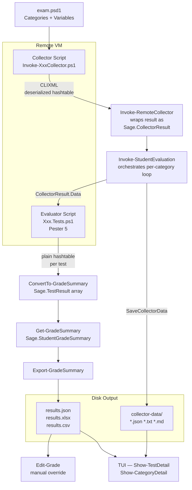
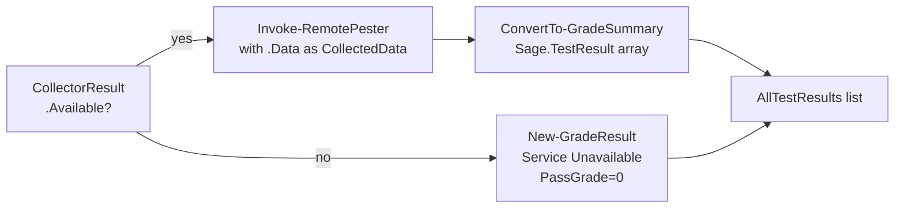
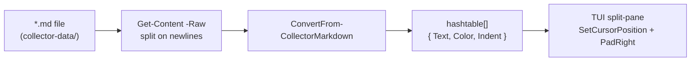
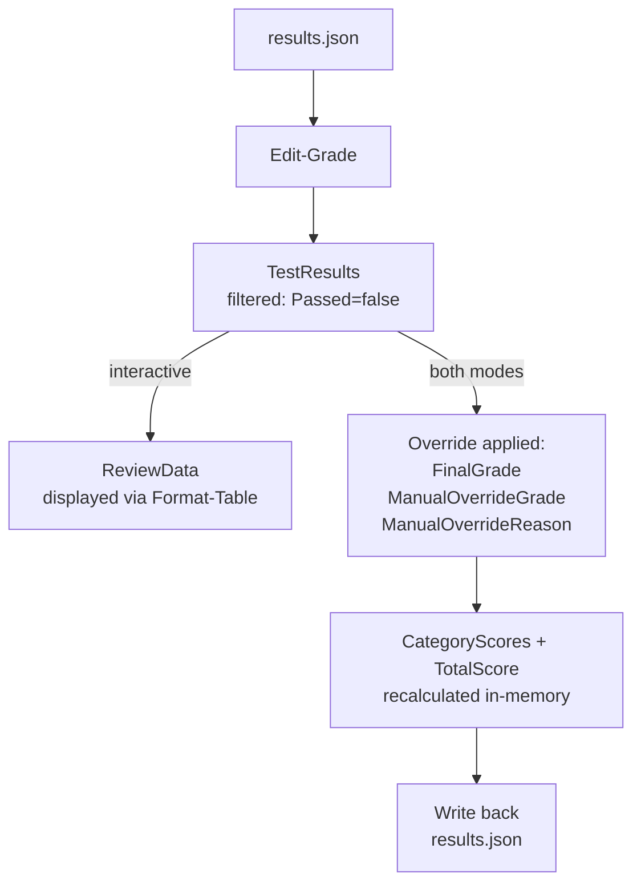
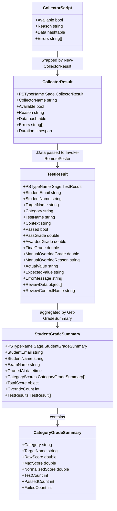

# Collector Data Pipeline

This document describes the full lifecycle of collector data in SAGE —
from remote collection on a VM through grading, export, and display in the
TUI and `Edit-Grade`.

---

## Table of Contents

- [Overview](#overview)
- [Stage 1 — Collector Script (remote VM)](#stage-1--collector-script-remote-vm)
- [Stage 2 — Invoke-RemoteCollector (local host)](#stage-2--invoke-remotecollector-local-host)
- [Stage 3 — Invoke-StudentEvaluation (orchestrator)](#stage-3--invoke-studentevaluation-orchestrator)
- [Stage 4 — Invoke-RemotePester (remote VM)](#stage-4--invoke-remotepester-remote-vm)
- [Stage 5 — ConvertTo-GradeSummary (local host)](#stage-5--convertto-gradesummary-local-host)
- [Stage 6 — Export-GradeSummary (disk)](#stage-6--export-gradesummary-disk)
- [Stage 7 — TUI Display](#stage-7--tui-display)
- [Stage 8 — Edit-Grade](#stage-8--edit-grade)
- [Data Structure Reference](#data-structure-reference)
- [File Layout Reference](#file-layout-reference)

---

## Overview



---

## Stage 1 — Collector Script (remote VM)

**Files:** `Sage/Collectors/Invoke-<Name>Collector.ps1`

Each collector is a standalone `.ps1` script that runs **on the remote VM**
via `Invoke-Command`. It receives a `$Variables` hashtable (from the exam
category definition) but typically ignores it — collection is data-independent.

### What collectors do

- Query system state using platform-appropriate tools
  (`Get-NetIPAddress`, `Get-DnsServerZone`, `Get-DhcpServerv4Scope`, …
  on Windows; `/proc/net/route`, `systemctl`, `nginx -T`, … on Linux)
- Build a flat `$Result` hashtable with a fixed schema:

```powershell
$Result = @{
    Available = $false   # set $true when data is obtained
    Reason    = $null    # human-readable explanation when Available=$false
    Data      = @{       # service-specific structured data
        ...
    }
    Errors    = @()      # non-fatal error strings
}
```

- Return `$Result` — **no output other than this hashtable**

### Why plain hashtables only

Collector output crosses a PowerShell remoting boundary as CLIXML.
Only primitive types and plain hashtables/arrays survive deserialization
correctly. Typed objects (`[PSCustomObject]` with `PSTypeName`),
`[datetime]`, `[timespan]`, and Pester/DSC-specific types are
**never used** in collector output.

### Collectors in the module

| Collector | Platform | Key `Data` keys |
|-----------|----------|-----------------|
| `GeneralConfig` | Windows + Linux | `Hostname`, `IPAddresses`, `NetAdapters`, `RdpEnabled`, `PingEnabled` |
| `Dns` | Windows | `Zones`, `Records`, `Forwarders` |
| `Ad` | Windows | `Domain`, `OUs`, `Users`, `Groups`, `Computers` |
| `Dhcp` | Windows | `Scopes`, `Reservations`, `Options`, `Exclusions`, `Authorized` |
| `FileServer` | Windows | `Shares`, `NtfsAcls`, `Folders`, `Files` |
| `Gpo` | Windows | `Gpos` (each with `Links`, `UserScope`, `ComputerScope`, `Permissions`) |
| `Iis` | Windows | `Sites`, `AppPools`, `Bindings`, `VirtualDirectories` |
| `Docker` | Linux | `Images`, `Containers`, `Dockerfile`, `Compose` |
| `Nginx` | Linux | `ServiceEnabled`, `ServiceRunning`, `ConfFiles`, `IndexFiles` |
| `Apache` | Linux | `ServiceEnabled`, `ServiceRunning`, `ConfFiles` |
| `BashHistory` | Linux | `History` |

---

## Stage 2 — Invoke-RemoteCollector (local host)

**File:** `Sage/Private/Invoke-RemoteCollector.ps1`

`Invoke-RemoteCollector` is the **local** orchestrator for one collector run.

### Steps

1. Resolves the local path `Sage/Collectors/Invoke-<Name>Collector.ps1`.
2. Copies the script to the remote VM via `Copy-File` (SFTP/SCP):
   - Windows: `$env:TEMP\sage-collectors\Invoke-<Name>Collector.ps1`
   - Linux: `/tmp/sage-collectors/Invoke-<Name>Collector.ps1`
3. Executes the script remotely: `& $remotePath -Variables $Variables`
4. Receives the raw `$Result` hashtable back over CLIXML.
5. Wraps it into a `Sage.CollectorResult` via `New-CollectorResult`.

### Sage.CollectorResult schema

```powershell
[PSCustomObject]@{
    PSTypeName    = 'Sage.CollectorResult'
    CollectorName = 'Dns'            # short name from exam.psd1
    Available     = $true            # $false if collection failed
    Reason        = $null            # failure explanation
    Data          = @{ ... }         # the collector's $Result.Data hashtable
    Errors        = @()              # non-fatal collector errors
    Duration      = [timespan]       # wall-clock time for the remote run
}
```

> When the remote execution throws, `Available` is `$false` and `Reason`
> holds the exception message. `Data` is an empty hashtable.

---

## Stage 3 — Invoke-StudentEvaluation (orchestrator)

**File:** `Sage/Public/Invoke-StudentEvaluation.ps1`

This function runs the entire per-student pipeline. For each exam `Category`
it:

1. Calls `Invoke-RemoteCollector` → `Sage.CollectorResult`
2. If `SaveCollectorData` is set, writes three files to disk (see
   [Stage 6](#stage-6--export-gradesummary-disk)).
3. If `CollResult.Available`:
   - Calls `Invoke-RemotePester`, passing `CollResult.Data` as
     `$CollectedData` into the evaluator.
   - Calls `ConvertTo-GradeSummary` to produce `Sage.TestResult` objects.
4. If **not** available:
   - Creates a single zero-grade `Sage.TestResult` via `New-GradeResult`
     with `TestName = "$CatName — Service Unavailable"`.



The `CollectorResult.Data` hashtable flows directly into
`Invoke-RemotePester` as `$CollectedData`. It is **not** transformed or
enriched at this stage — the raw collected data is what the evaluator tests.

---

## Stage 4 — Invoke-RemotePester (remote VM)

**File:** `Sage/Private/Invoke-RemotePester.ps1`

`Invoke-RemotePester` runs the `Xxx.Tests.ps1` evaluator script **on the
remote VM** inside a Pester 5 container.

### Data injected into the evaluator

| Parameter | Source |
|-----------|--------|
| `$ExamVariables` | `exam.psd1` → `Categories[n].Variables` |
| `$CollectedData` | `CollectorResult.Data` (raw from Stage 1) |

The evaluator reads `$CollectedData` to write assertions against the
actual system state, and reads `$ExamVariables` for expected values
(e.g. IP addresses, zone names, user names).

### CLIXML-safe extraction

Pester `Test` objects do **not** survive CLIXML deserialization as typed
objects. `Invoke-RemotePester` extracts everything needed into plain
hashtables on the remote side **before** the result crosses the PSSession
boundary:

```powershell
@{
    ExpandedName = $T.ExpandedName  # -ForEach expanded description
    Name         = $T.Name          # raw template name
    Result       = $T.Result.ToString()  # 'Passed' | 'Failed'
    Context      = $CtxName         # innermost named Context block
    Data         = $DataHt          # -ForEach data hashtable (contains PassGrade)
    ErrorMessage = $ErrMsg          # exception message string
}
```

The `Data` hashtable is a **copy** of the `-ForEach` parameter hash,
which always includes `PassGrade` and any other test-specific keys
(e.g. `ExpectedPtr`, `Zone`, `IPAddress`).

### ReviewContextMap

Each evaluator (`Xxx.Tests.ps1`) defines a `$ReviewContextMap` hashtable
at file scope. Each entry maps a Pester Context name to a scriptblock that
extracts display-friendly data from `$CollectedData` for use in
`Edit-Grade`'s review screen:

```powershell
$ReviewContextMap = @{
    'A Records' = {
        param($Data)
        $Data.Records | Where-Object { $_.RecordType -eq 'A' } | ForEach-Object {
            [PSCustomObject]@{ HostName = $_.HostName; Value = $_.Value }
        }
    }
    ...
}
```

`ConvertTo-GradeSummary` invokes the relevant scriptblock when a test fails
and the context name is found in the map.

---

## Stage 5 — ConvertTo-GradeSummary (local host)

**File:** `Sage/Private/ConvertTo-GradeSummary.ps1`

Processes the plain-hashtable test list from `Invoke-RemotePester` and
produces `Sage.TestResult` objects.

### Per-test processing

| Field | Source |
|-------|--------|
| `PassGrade` | `Test.Data.PassGrade` (from `-ForEach` in evaluator) |
| `Passed` | `Test.Result -eq 'Passed'` |
| `TestName` | `Test.ExpandedName` → fallback `Test.Name` → fallback generated |
| `Context` | `Test.Context` (innermost Pester Context block name) |
| `ActualValue` | Parsed from `Test.ErrorMessage` via regex |
| `ExpectedValue` | Parsed from `Test.ErrorMessage` via regex |
| `ReviewData` | `ReviewContextMap[$Context].Invoke($CollectedData)` |
| `ReviewContextName` | Same as `Context` |

### Sage.TestResult schema

```powershell
[PSCustomObject]@{
    PSTypeName           = 'Sage.TestResult'
    StudentEmail         = 'student@school.be'
    StudentName          = 'Daan Banaan'
    StudentData          = @{ ip = '10.1.2.3'; ... }
    TargetName           = 'DC1'
    Category             = 'DNS DC1'
    TestName             = 'A record dc1 should be 192.168.1.3 in zone proef.be'
    Context              = 'A Records'
    Passed               = $true
    PassGrade            = 3.0
    FailGrade            = 0.0
    AwardedGrade         = 3.0
    FinalGrade           = 3.0       # updated in-place by Edit-Grade
    ActualValue          = $null
    ExpectedValue        = $null
    ErrorMessage         = $null
    ManualOverrideGrade  = $null     # set by Edit-Grade
    ManualOverrideReason = $null     # set by Edit-Grade
    ReviewData           = @(...)    # structured data for Edit-Grade review panel
    ReviewContextName    = 'A Records'
    Timestamp            = [datetime]::Now
}
```

---

## Stage 6 — Export-GradeSummary (disk)

**Files:** `Sage/Public/Export-GradeSummary.ps1`,
`Sage/Private/Format-CollectorData.ps1`

### Collector data files (SaveCollectorData)

When `SaveCollectorData` is set (always `$true` in the TUI,
optional in `Invoke-StudentEvaluation`), three files are written per
category to `<output>/<student>/collector-data/`:

| File | Function | Format | Consumer |
|------|----------|--------|----------|
| `<Target>-<Category>-collector.json` | — | Full `Sage.CollectorResult` serialized as JSON (depth 10) | Debugging, scripting |
| `<Target>-<Category>-collector.txt` | `Format-CollectorData` | Human-readable plain text | Terminal inspection |
| `<Target>-<Category>-collector.md` | `Format-CollectorDataMarkdown` | Structured Markdown with headings, code blocks, tables | TUI drill-down panel |

#### Format-CollectorData (plain text)

Renders `CollectorResult.Data` into indented, labelled text sections per
collector type. Each collector type has a dedicated private formatter
function inside `Format-CollectorData.ps1` (e.g. `Format-DnsData`,
`Format-AdData`, `Format-GeneralConfigData`).

#### Format-CollectorDataMarkdown (Markdown for TUI)

Renders the same data as structured Markdown (`#` headings, fenced code
blocks, bullet lists). Dedicated per-type functions (e.g.
`Format-DnsDataMarkdown`, `Format-GeneralConfigDataMarkdown`) handle the
conversion.

> **GeneralConfig note:** The `IPAddresses` array carries `IPAddress`,
> `PrefixLength`, and `PrefixOrigin`; gateway and DNS servers live in the
> separate `NetAdapters` array (keyed by `InterfaceAlias`). Both
> formatters perform an adapter lookup to join the two arrays before
> rendering, with fallback to inline fields for backward compatibility.

### Grade summary files (results.json)

`Export-GradeSummary` serializes `Sage.StudentGradeSummary` to
`results.json`. Key structure:

```json
{
  "_type": "Sage.StudentGradeSummary",
  "StudentName": "Daan Banaan",
  "CategoryScores": [
    {
      "Category": "DNS DC1",
      "RawScore": 22,
      "MaxScore": 27,
      "NormalizedScore": 16.3
    }
  ],
  "TotalScore": { "Raw": 200, "Max": 300, "Normalized": 13.33 },
  "OverrideCount": 0,
  "TestResults": [
    {
      "TestName": "A record dc1 should be 192.168.1.3",
      "Passed": true,
      "PassGrade": 3,
      "FinalGrade": 3,
      "ManualOverrideGrade": null,
      "ReviewData": [ "..." ]
    }
  ]
}
```

`ReviewData` is embedded directly in each `TestResult` entry — it was
captured at evaluation time from `$CollectedData` and is fully
self-contained in the JSON file.

---

## Stage 7 — TUI Display

**Files:** `Sage/tui/Private/Show-TestDetail.ps1`,
`Sage/tui/Private/Show-CategoryDetail.ps1`,
`Sage/tui/Private/Compare-Results.ps1`

### Source files consumed by the TUI

| Screen | Source file | Key data |
|--------|-------------|----------|
| Results Summary | `results.json` | `CategoryScores`, `TotalScore` |
| Category Detail | `results.json` | `TestResults` filtered by category |
| Test Detail — left panel | `results.json` | Single `TestResult` |
| Test Detail — right panel | `collector-data/<T>-<Cat>-collector.md` | Markdown collector report |
| Compare Runs | `results.json` from earlier run | `TestResults` diff |

### Markdown → display line conversion

`Show-TestDetail` reads the `.md` file and passes lines to
`ConvertFrom-CollectorMarkdown` (in `Compare-Results.ps1`):



`ConvertFrom-CollectorMarkdown` parses Markdown syntax and assigns a
`ConsoleColor` to each line:

| Markdown element | Display treatment |
|------------------|-------------------|
| `# H1` | Theme `Primary` colour, 2-space indent |
| `## H2` | Theme `Accent` colour, 2-space indent |
| `### H3` | `Cyan`, 4-space indent |
| `#### H4` | `DarkCyan`, 6-space indent |
| ` ```...``` ` | `White`, indented by `2 × heading_level` |
| `- bullet` | `White`, rendered as `•` |
| `> blockquote` | Theme `Warn` colour |
| `**bold**` | Theme `Accent` colour, `**` stripped |

---

## Stage 8 — Edit-Grade

**File:** `Sage/Public/Edit-Grade.ps1`

`Edit-Grade` reads `results.json` from disk and allows a teacher to
override `FinalGrade` for any failed test.



`ReviewData` (captured at evaluation time, embedded in `results.json`) is
shown in interactive mode via `Format-Table -AutoSize`, giving the teacher
full context without leaving the command line.

After all overrides are applied, `Edit-Grade` recalculates `CategoryScores`
and `TotalScore` from the updated `FinalGrade` values and writes the
document back to `results.json` in-place.

---

## Data Structure Reference



---

## File Layout Reference

```text
<output-dir>/
└── <student-name>/
    ├── results.json               ← Sage.StudentGradeSummary (primary)
    ├── results.xlsx               ← optional Excel export
    ├── results.csv                ← optional CSV export
    └── collector-data/
        ├── DC1-DNS_DC1-collector.json   ← full Sage.CollectorResult (JSON)
        ├── DC1-DNS_DC1-collector.txt    ← Format-CollectorData (plain text)
        ├── DC1-DNS_DC1-collector.md     ← Format-CollectorDataMarkdown (TUI)
        ├── DC1-AD_DC1-collector.json
        ├── DC1-AD_DC1-collector.txt
        ├── DC1-AD_DC1-collector.md
        └── ...
```

File naming pattern: `<TargetName>-<SafeCategory>-collector.<ext>`
where `<SafeCategory>` has spaces replaced by `_` and special characters
stripped.

---

## Key Constraint: CollectorData is not re-read into the grading pipeline

- **`results.json`** is the single source of truth for grading.
- **`collector-data/*.md`** is read only by the TUI for display purposes.
- **`ReviewData`** embedded in `results.json` is what `Edit-Grade` uses —
  it was captured at evaluation time from `$CollectedData` and is fully
  self-contained in the JSON file.
